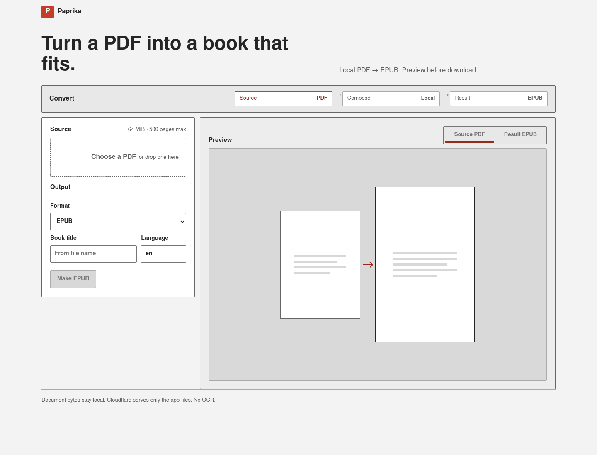
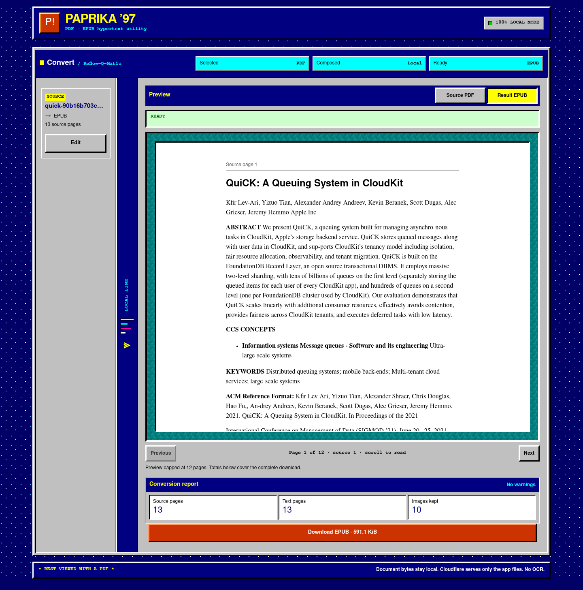
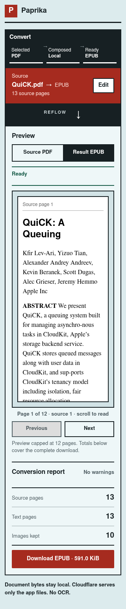
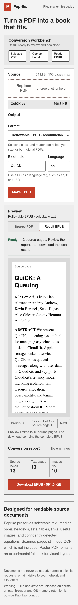

# Reliability and redesign audit

This document records the acceptance evidence for Paprika’s reliability work and the interface review on `feat/90s-redesign`. The branch remains separate from `main`; this document and its screenshots do not describe a production deployment.

## Defect-to-test traceability

| Risk | Implemented safeguard | Defect-detecting evidence |
| --- | --- | --- |
| Failed CLI writes truncate an existing destination | Write to a sibling temporary file, flush it, then install it atomically | `failed_forced_write_does_not_truncate_existing_destination` injects a partial-write failure and verifies that the original bytes remain and no staging file leaks |
| A no-clobber write races with another writer | Install completed staging files without replacing an existing destination | `no_force_write_does_not_clobber_a_racing_destination` creates the destination during the staged write and verifies that the competing bytes win |
| Raster pages silently clip writes | Reject source or destination rectangles outside their raster bounds | `out_of_bounds_blits_fail_without_modifying_the_destination` verifies both an error and an unchanged destination |
| Oversized content can exceed the target canvas | Scale to both available width and height | `oversized_words_fit_inside_both_canvas_dimensions` verifies the painted rows stop inside the usable canvas |
| Raster memory accounting omits the active output canvas | Charge the active canvas and release completed-page budget when pages are drained | `output_pixel_budget_counts_the_active_canvas`, `draining_completed_pages_releases_pixel_budget`, and `streams_documents_larger_than_the_raster_buffer_budget` |
| Encoded images or the final EPUB can exceed output limits during writes | Use bounded writers for image encoders and the EPUB archive | `bounds_encoded_image_buffers` and `bounds_final_epub_writes` force small limits and require the matching limit errors |
| XHTML wrappers or image decoding bypass semantic budgets | Account final rendered XHTML plus per-page and cumulative image objects/pixels | `accounts_for_the_complete_rendered_xhtml` and `enforces_per_page_and_cumulative_image_limits` |
| Recoverable scan pages are silently omitted | Recognize full-page images and downsample within the pixel budget | `downsamples_recoverable_full_page_scans` checks downsampling, visual-page classification, and rejection beyond the safe bound; `distinguishes_empty_and_image_only_books` verifies warning classification |
| Caption text alone creates a false figure | Require nearby graphic geometry and tighten semantic exclusion to it | `ignores_figure_captions_without_graphic_geometry`, `tightens_semantic_exclusion_to_graphic_bounds`, and `measures_image_overlap_for_crop_deduplication` |
| Mathematical text is emitted confidently when extraction is unreliable | Keep trustworthy prose, crop bounded visual regions, and reject false equation anchors | Equation, math-density, visual-column, figure/table veto, and prose-retention tests in `crates/paprika-epub/src/tests.rs` |
| Invalid or unsafe document language reaches EPUB XML | Parse and canonicalize BCP 47 tags, falling back to `en` | `rejects_invalid_language_metadata`; a real `--language fr-FR` conversion was also inspected for `<dc:language>fr-FR</dc:language>`, `xml:lang="fr-FR"`, and `lang="fr-FR"` |
| Browser failures are silent or leave stale state | Report sanitized diagnostics, reject stale worker generations, and recreate workers after cancel/failure | Cross-browser tests `cancels a job and converts again with a fresh worker`, `surfaces conversion warnings before download`, and `shows safe diagnostics and recovers from invalid input` |
| Preview security boundaries are conflated | Keep generated EPUB XHTML sanitized and sandboxed; use the documented browser-native boundary for local PDF blobs | Cross-browser test `uses the documented local PDF preview boundary` plus `docs/privacy.md` |
| Narrow and zoomed layouts clip controls | Remove minimum viewport assumptions, bound native controls and fieldsets, and include actionable overflow diagnostics | Cross-browser tests `keeps the conversion workbench usable at 320 CSS pixels` and `remains usable at 200 percent zoom` |
| A centered paper title is split by two-column reading order | Reconstruct only the first semantic heading from matching display-sized geometry; lower wrapped rows also require confirmation from the selected document title so bylines stay separate | Geometry tests cover split and wrapped titles, same-style bylines, malformed bounds, and independent columns; pinned QuiCK and BERT conversions assert the complete chapter/navigation title and reject detached fragments |
| Bold run-in section headings merge into their first body paragraph | Promote bounded uppercase or numbered bold prefixes to semantic `h2` blocks while preserving captions and ordinary bold lead-ins | Unit tests cover section repair and false-positive guards; the pinned QuiCK check requires separate `CONCLUSIONS` and `ACKNOWLEDGMENTS` headings |

The Rust tests intentionally exercise failures, races, bounds, and observable output rather than mirroring internal call sequences.

## Automated validation

The local release gate was run from the feature worktree:

```text
bun run predeploy
  rustfmt: passed
  Clippy --workspace --all-targets -D warnings: passed
  workspace tests: 67 passed (CLI 4, core 14, EPUB 43, PDF 6)
  wasm32-unknown-unknown check: passed
  browser JavaScript bundle/static-entry checks: passed
  bounded fuzz-target compilation: passed
  real-paper conversions: QuiCK, Attention Is All You Need, BERT, and Bitcoin
  titles, bylines, section-heading separation, source-page counts, semantic markers, and detached-fragment checks: passed
  QuiCK `--no-images` title and no-asset checks: passed
  EPUBCheck 5.3.0: 0 fatals, 0 errors, 0 warnings for all five outputs
  production WASM build: passed
  deploy-file allowlist and license comparison: passed
  wrangler deploy --dry-run: passed
```

The [feature-branch workflow history](https://github.com/angristan/paprika/actions/workflows/pre-deploy.yml?query=branch%3Afeat%2F90s-redesign) records the locked build job and native tests on Ubuntu 24.04, macOS 14, and Windows 2022. Its browser step runs 42 tests across Chromium, Firefox, and WebKit. Each engine runs the axe WCAG A/AA audit, local-only request check, 320 CSS-pixel layout check, 200% zoom check, synthetic EPUB conversion/download, the pinned real QuiCK title regression, warning, cancellation/retry, raster preview, and diagnostic-recovery cases.

`main` branch protection requires these four exact checks with strict status checks and administrator enforcement:

- `Locked build and smoke tests`
- `Native tests (ubuntu-24.04)`
- `Native tests (macos-14)`
- `Native tests (windows-2022)`

## Reproducible build and supply chain

Two consecutive executions of `scripts/build-web-cloudflare.sh` produced the same aggregate SHA-256 over every file in `web/dist/`:

```text
53c6d687f305b2ec7ee2cb5c21ebc0e17268a4718e2b65de41d2aa20d5464e64
```

The first execution populated the cache. The second finished without Rust compilation and restored verified WASM cache entry:

```text
792e92ef8c4e4c3d29917706c56e337c45b6fe60b2dcc3f6624d82b8766a864c
```

The build scripts verify pinned SHA-256 values before executing or consuming downloaded rustup-init, wasm-pack archive/binary, EPUBCheck archive/JAR, and all four public paper fixtures. Cached WASM files have their own `SHA256SUMS`, and the cache key covers the pinned compiler, wasm-pack version, optimization mode, Rust flags, lockfile, manifests, Rust sources, and build script.

## Rendered review

The following screenshots were captured from a fresh local `web/dist/` build at the validated product commit using Chromium and the public QuiCK PDF fixture.

### Desktop, empty state



The first viewport is a restrained early-web publishing page: a narrow white canvas, serif masthead, pixel pepper mark, blue links, thin rules, ordinary form controls, and a direct fixed-PDF-to-reflowed-book diagram. Paprika red is reserved for identity, the primary action, and the output edge. There is no simulated desktop, application chrome, pattern, fake counter, award, web ring, or dead navigation.

### Desktop, completed EPUB



The completed state contracts setup into a narrow source docket with the filename, output format, source-page count, and **Edit** action while the generated reader expands. It identifies the active preview, bounds prose to a readable measure, distinguishes the capped preview from complete-download totals, reports source/text/image counts, and gives the download one clear visual priority.

### Mobile, 320 CSS pixels



The utility stacks into one column without horizontal scrolling. The **Local** divider becomes a short horizontal arrow between the compact source docket and reader; **Edit** restores the full labeled controls. The result appears before secondary settings, counts remain aligned, and preview navigation, warnings, download, and privacy stay in document order.

### 200% zoom



At 200% zoom the same task order remains usable without horizontal document overflow. Controls, preview, report, download, and privacy stay reachable. Compact route labels remain complete, and longer text wraps without horizontal overflow.

The automated axe scan found no WCAG 2 A/AA or WCAG 2.1 A/AA violations in Chromium, Firefox, or WebKit. The CSS also provides visible `:focus-visible` treatment, at least 44-pixel primary control targets, semantic native controls, live status regions, and a reduced-motion override.

### Impeccable catalogue pass

The rendered states were re-audited against the complete [Impeccable slop catalogue](https://impeccable.style/slop/#catalog). The redesign:

- replaces both generic product polish and simulated application chrome with one task-specific publishing page and a real PDF → EPUB route;
- uses a white canvas, serif masthead, pixel mark, blue links, thin rules, and one Paprika action accent instead of wallpaper, title bars, gradients, glass, rounded cards, or decorative feature tiles;
- keeps the task statement inside the setup column instead of adding a detached marketing hero;
- contracts the completed source into a useful docket and promotes the generated book;
- preserves narrow-screen gutters, readable preview text, aligned counts, and familiar native controls; and
- documents every application font, color, type-size role, and intentional nostalgic reference in `DESIGN.md`.

Early-web typography, the pixel pepper, default link language, and document-like structure carry the 1990s reference without competing with the task. There are no nostalgia props, rainbow accents, fake metrics, fake browser controls, marquees, blinking body copy, cursor effects, or external assets. During real conversion, only three small packets in the **Local** divider animate. Serif text inside the preview belongs to the generated EPUB, not the application type system.

## Documentation review

- `README.md` covers CLI behavior, browser limits and lifecycle, preview behavior, Cloudflare deployment, architecture, local development, and each validation command.
- `docs/privacy.md` distinguishes local document processing from normal static-host request metadata, explains object-URL retention limits, and documents the separate EPUB-sandbox and browser-native PDF trust boundaries.
- `docs/release.md` defines the locked release gate, required GitHub checks, pinned external inputs, exact Workers Builds settings, production smoke checks, and an approval-gated non-destructive rollback procedure.
- `DESIGN.md` defines the Paprika early-web publishing direction, evidence requirements, 320-pixel behavior, intentional period references, anti-pattern exclusions, keyboard/touch expectations, preview state, and reduced-motion behavior.

No production deployment or merge is part of this audit branch.
